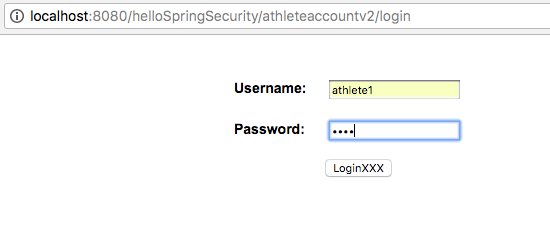

# Spring Security Learning Project

## NOTE: This is still very much a learning-development project so the source code is littered with comments, some useful but most are not. This will all be cleaned up and a final release version uploaded which will be marked as such at the top of this README file when it is shortly.

Once logged in you will get a listing screen or a default landing page. The listing screen will depend on existing entries and if you have permission to view them.

### Log-in page

### Athlete listing page

### Creating a new athlete account page

### Edit existing athlete details

### Default landing page is just a basic text page 

## Development Overview
Below is a listing of the various releases where each one provides a brief development description. Each release is available for download at: https://github.com/mccarthyr/springsecurity/releases

### v1.0 
Release contains the basic secured hello world set up using in-memory users (configured in applicationContext-security.xml). Only when you have logged in will the message be displayed.
https://github.com/mccarthyr/springsecurity/releases/tag/v1.0

Tomcat Maven Deploy is configured in the pom.xml and set to localhost. Adjust as required. 

### v2.0 
Release contains a full CRUD In-Memory demo, using Security Roles, Service, Dao and Domain objects. It comes
pre-configured with a few entries that will display for two of the registered In-Memory users ( in the applicationContext-security.xml file) which can be edited and deleted. New entries can and also be created/edited/deleted.

The entries that are created and already set up and held in an ArrayList in the domain object (com.fireduptech.springsecurity.domain.AthleteAccountDetails) in this version as no database is used.
https://github.com/mccarthyr/springsecurity/releases/tag/v2.0

### v3.0 
Release contains a full CRUD ACL database driven solution with an exiting admin and two regular users and roles. Functionality has been added to allow a regular user to provide access to the admin user who can then close an account. 

The Domain object that is secured is an AthleteAccountDetails object which is simulating account details for an athlete on what could be a sports data system. An Athlete role can create, edit and update their account but only an Admin role can close then account. The Admin role does not automatically have access to the Athlete account and has to be given access by the owner of the account.

The file SpringSecurityAclDatabase.sql contains a sql dump that you can execute in your database to create the required ACL tables, users and authorities tables and also the project specific table used here - athlete_account.
https://github.com/mccarthyr/springsecurity/blob/master/SpringSecurityAclDatabase.sql

### v4.0 
Release contains a basic custom registration system that integrates with the ACL database tables also and does a programmatic login once registration is successful.
NOTE: This is just a basic demo registration and the code currently contains a lot of comments as this is still actively in development. The purpose of this is to have a basic template of code to build from and a useful reference as this contains Spring Data JPA entities that have been integrated to use the Spring Security ACL database tables, utilising features such as composite primary keys and @EmbeddedId annotation for an embedded class to represent such keys along with code to access fields from such entities. 
https://github.com/mccarthyr/springsecurity/releases/tag/v4.0

### v5.0 
Release includes the use of the BCryptPasswordEncoded to encode a users password during registration. This is set up in the applicationContext-Security.xml and also then implemented in the UserServiceImpl class which has the passwod encoded autowired into it and simply calls the encoders encode method. Springs implentation of the BCryptPasswordEncoded has a salt built into it which is generated each time the encode method is called. This means you only need to encode the password once as you could get a different encoded value for the same password by encoding it again due to the generated salt each time.

The Spring ACL that is configured by default will match the encoded passwords for you when you log in the next time. Otherwise you would have to use the matches() method on the encoder to do this.
https://github.com/mccarthyr/springsecurity/releases/tag/v5.0

### v6.0 
Final Release. Finished with user registration demo and logging in creating athlete accounts. This version implemented Transactions and full registration of new users on to the system while integrating them into the ACL database schema setup through the user of JPA.
https://github.com/mccarthyr/springsecurity/releases/tag/v6.0
